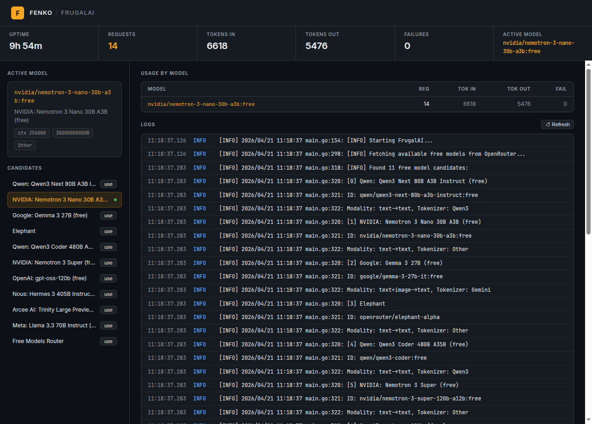

# FrugalAI - OpenRouter LLM Proxy

An intelligent LLM proxy that automatically routes requests to the best free model available on OpenRouter. Provides both OpenAI and Anthropic compatible API endpoints.



## Features

- **Automatic Model Selection**: Intelligently selects the best free model based on:
  - Parameter count (model size)
  - Popularity score
  - Context length
  - Architecture preferences
- **Dual API Compatibility**: Works with both OpenAI and Anthropic client libraries
- **Smart Caching**: Caches model list to reduce API calls
- **Configurable Constraints**: Set minimum parameter counts and popularity thresholds
- **Streaming Support**: Full support for streaming responses

## Vulpes Plugin

FrugalAI can also run as a Vulpes `upstream_provider` plugin from this repository:

```bash
go build -o bin/vulpes-frugalai-plugin ./cmd/vulpes-frugalai-plugin
```

See [`cmd/vulpes-frugalai-plugin/README.md`](cmd/vulpes-frugalai-plugin/README.md) for Vulpes config.

## Installation

```bash
go install github.com/mosajjal/frugalai/cmd/frugalai@latest
```

Or build from source:

```bash
git clone https://github.com/mosajjal/frugalai.git
cd frugalai
go build -o frugalai ./cmd/frugalai
```

## Usage

### Basic Usage

```bash
# Using environment variables
export FRUGALAI_API_KEY="your-openrouter-api-key"
frugalai

# Using CLI flags
frugalai -api-key "your-openrouter-api-key"
```

### Configuration Options

| Flag | Environment Variable | Default | Description |
|------|---------------------|---------|-------------|
| `-api-key`, `-k` | `FRUGALAI_API_KEY` | *required* | OpenRouter API key |
| `-port`, `-p` | `FRUGALAI_PORT` | `8080` | Server port |
| `-min-params` | `FRUGALAI_MIN_PARAMS` | `0` | Minimum parameter count |
| `-min-popularity` | `FRUGALAI_MIN_POPULARITY` | `0` | Minimum popularity score |
| `-enable-openai` | - | `true` | Enable OpenAI-compatible API |
| `-enable-anthropic` | - | `true` | Enable Anthropic-compatible API |
| `-openai-path` | - | `/v1` | OpenAI endpoint path |
| `-anthropic-path` | - | `/v1` | Anthropic endpoint path |
| `-log-level` | `FRUGALAI_LOG_LEVEL` | `info` | Log level |
| `-cache-ttl` | `FRUGALAI_CACHE_TTL` | `300` | Model cache TTL (seconds) |
| `-preferred-arch` | `FRUGALAI_PREFERRED_ARCH` | - | Preferred architectures (comma-separated) |
| `-ui-basic-auth` | `FRUGALAI_UI_BASIC_AUTH` | - | Basic auth for `/admin/*` routes (`user:pass`) |
| `-proxy-api-key` | `FRUGALAI_PROXY_API_KEY` | - | Require this key on inference routes (`Authorization: Bearer` or `x-api-key`) |

### Example Configurations

**Only use models with at least 30B parameters:**
```bash
frugalai -k "$API_KEY" -min-params 30000000000
```

**Prefer transformer-based models:**
```bash
frugalai -k "$API_KEY" -preferred-arch "transformer,llama"
```

**Run on custom port with debug logging:**
```bash
frugalai -k "$API_KEY" -p 9000 -log-level debug
```

## API Endpoints

### OpenAI-Compatible API

```
POST http://localhost:8080/v1/chat/completions
GET  http://localhost:8080/v1/models
```

### Anthropic-Compatible API

```
POST http://localhost:8080/v1/messages
```

### Admin Endpoints

All admin routes live under `/admin/` and are optionally protected by `--ui-basic-auth`. `/health` is also available at root without auth for container and load-balancer probes.

```
GET  http://localhost:8080/health                  # Health check — no auth, always accessible
GET  http://localhost:8080/admin/health            # Same, under /admin/
GET  http://localhost:8080/admin/model             # Current selected model info
POST http://localhost:8080/admin/model/switch      # Switch to the next probe-validated candidate
POST http://localhost:8080/admin/model/refresh     # Re-fetch candidates and re-pick a probe-validated model
GET  http://localhost:8080/admin/candidates        # List all ranked candidates
GET  http://localhost:8080/admin/probe             # Live probe of current model
POST http://localhost:8080/admin/probe?model=<id>  # Live probe of a specific model
GET  http://localhost:8080/admin/ui/               # Web dashboard
GET  http://localhost:8080/admin/metrics           # Prometheus metrics
```

### Prometheus Metrics

`GET /metrics` returns Prometheus text-format (0.0.4) counters and gauges:

| Metric | Type | Description |
|--------|------|-------------|
| `frugalai_requests_total` | counter | Total completed requests |
| `frugalai_tokens_in_total` | counter | Total prompt tokens consumed |
| `frugalai_tokens_out_total` | counter | Total completion tokens generated |
| `frugalai_failures_total` | counter | Total failed requests |
| `frugalai_uptime_seconds` | gauge | Seconds since process start |
| `frugalai_model_requests_total{model="…"}` | counter | Requests per upstream model |
| `frugalai_model_tokens_in_total{model="…"}` | counter | Prompt tokens per upstream model |
| `frugalai_model_tokens_out_total{model="…"}` | counter | Completion tokens per upstream model |
| `frugalai_model_failures_total{model="…"}` | counter | Failures per upstream model |

Example Prometheus scrape config:

```yaml
scrape_configs:
  - job_name: frugalai
    static_configs:
      - targets: ['localhost:8080']
    metrics_path: /admin/metrics
```

## Client Examples

### OpenAI Python Client

```python
from openai import OpenAI

client = OpenAI(
    base_url="http://localhost:8080/v1",
    api_key="any-key"  # Not used by proxy
)

response = client.chat.completions.create(
    model="auto",  # Let proxy select best model
    messages=[{"role": "user", "content": "Hello!"}]
)
print(response.choices[0].message.content)
```

### Anthropic Python Client

```python
import anthropic

client = anthropic.Anthropic(
    base_url="http://localhost:8080/v1",
    api_key="any-key"  # Not used by proxy
)

message = client.messages.create(
    model="claude-3-haiku",  # Will be auto-selected
    max_tokens=1024,
    messages=[{"role": "user", "content": "Hello!"}]
)
print(message.content[0].text)
```

### cURL Examples

```bash
# OpenAI format
curl http://localhost:8080/v1/chat/completions \
  -H "Content-Type: application/json" \
  -d '{
    "model": "auto",
    "messages": [{"role": "user", "content": "Hello!"}]
  }'

# Anthropic format
curl http://localhost:8080/v1/messages \
  -H "Content-Type: application/json" \
  -H "anthropic-version: 2023-06-01" \
  -d '{
    "model": "claude-3-haiku",
    "max_tokens": 1024,
    "messages": [{"role": "user", "content": "Hello!"}]
  }'
```

## Model Selection Algorithm

FrugalAI ranks free models first, then probes them live before promotion. A higher score improves ordering, but the final winner is the first ranked candidate whose upstream probe returns a normal non-error completion.

Ranking inputs:

1. Popularity: 30% weight, normalized logarithmically
2. Parameters: 40% weight, normalized with 70B and above saturating at max score
3. Context Length: 20% weight, normalized with 200k and above saturating at max score
4. Preferred Architecture Bonus: +0.1 for configured architecture matches
5. Top Weekly Bonus: +0.5 for exact matches in the curated top weekly list
6. Quality Family Bonus: family-based bonuses such as Anthropic +0.15, OpenAI +0.12, Google +0.10, NVIDIA Nemotron +0.07, Qwen +0.07
7. Stealth Launch Bonus: +0.4 for recently published free models from known providers

Normalization and fallback behavior:

- Only free models are ranked
- Meta-routers such as openrouter/free are skipped during normal ranking and appended as a last-resort fallback
- When OpenRouter omits params, FrugalAI infers them from the model ID, name, or description, for example 30B, 120B, or 1.5T
- Missing popularity or params fall back to neutral mid-range normalization values instead of zeroing the score
- tiny, mini, nano, and micro names receive a small penalty

## Getting an OpenRouter API Key

1. Visit [OpenRouter.ai](https://openrouter.ai)
2. Sign up for a free account
3. Get your API key from the settings page

Free models on OpenRouter rotate periodically. This proxy automatically selects the best available free model at any given time.

## Development

```bash
# Run tests
go test ./...

# Run with coverage
go test -cover ./...

# Build
go build -o frugalai ./cmd/frugalai
```

## Docker

### Building the Image

```bash
docker build -t frugalai .
```

### Running the Container

**Basic usage:**
```bash
docker run -d \
  --name frugalai \
  -p 8080:8080 \
  -e FRUGALAI_API_KEY="your-openrouter-api-key" \
  frugalai
```

**With custom options:**
```bash
docker run -d \
  --name frugalai \
  -p 9000:9000 \
  -e FRUGALAI_API_KEY="your-openrouter-api-key" \
  -e FRUGALAI_PORT=9000 \
  -e FRUGALAI_MIN_PARAMS=7000000000 \
  -e FRUGALAI_LOG_LEVEL=debug \
  frugalai
```

### Using Docker Compose

Create a `docker-compose.yml` file:

```yaml
version: '3.8'

services:
  frugalai:
    image: frugalai
    container_name: frugalai
    ports:
      - "8080:8080"
    environment:
      - FRUGALAI_API_KEY=${FRUGALAI_API_KEY}
      - FRUGALAI_PORT=8080
      - FRUGALAI_MIN_PARAMS=0
      - FRUGALAI_LOG_LEVEL=info
    restart: unless-stopped
    healthcheck:
      test: ["CMD", "wget", "--no-verbose", "--tries=1", "--spider", "http://localhost:8080/health"]
      interval: 30s
      timeout: 3s
      start_period: 5s
      retries: 3
```

Run with Docker Compose:
```bash
# Start the service
docker-compose up -d

# View logs
docker-compose logs -f

# Stop the service
docker-compose down
```

### Volume Mounts

For custom configuration or caching, mount a volume:

```bash
docker run -d \
  --name frugalai \
  -p 8080:8080 \
  -v ${PWD}/data:/home/appuser/.local/share/frugalai \
  -e FRUGALAI_API_KEY="your-openrouter-api-key" \
  frugalai
```

## License

MIT License
